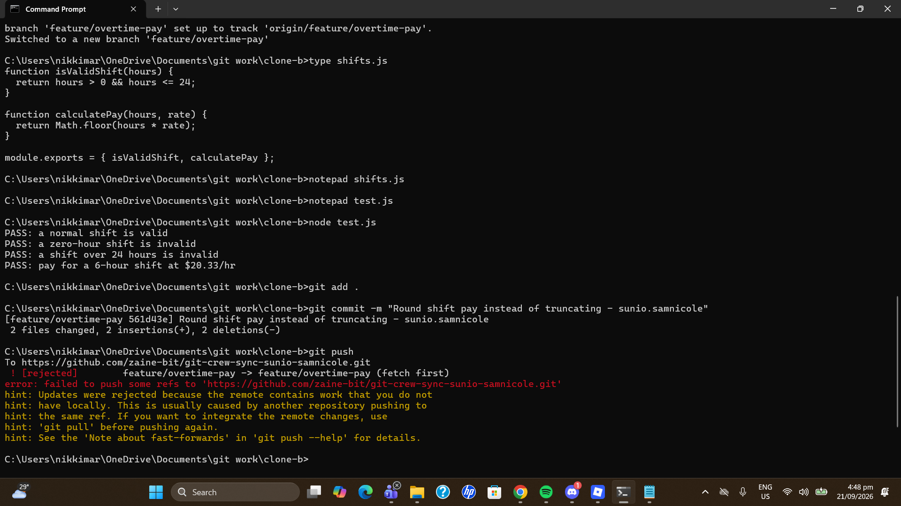
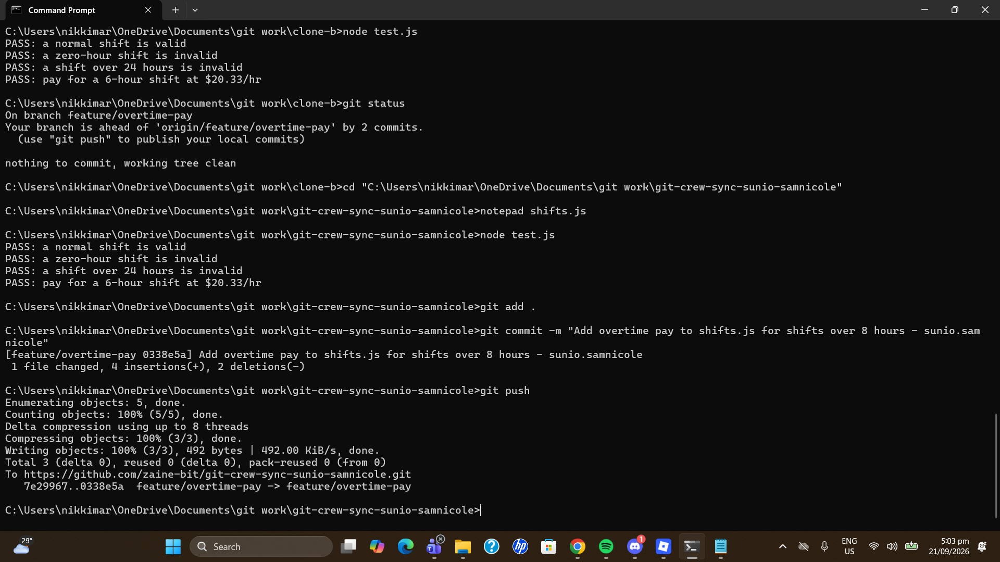
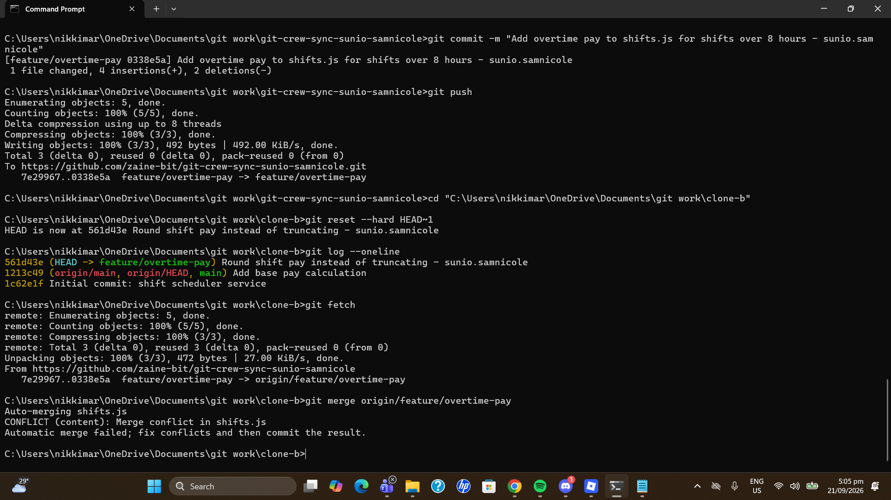
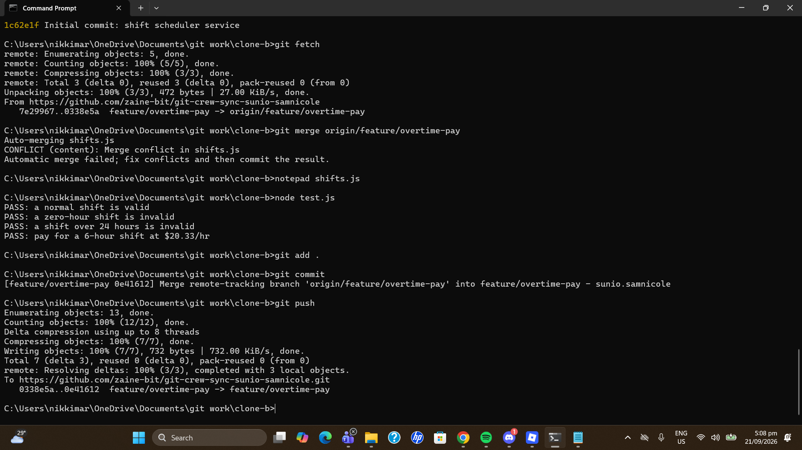
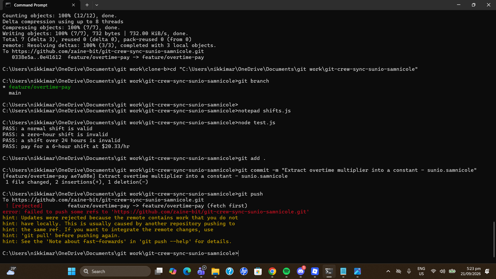
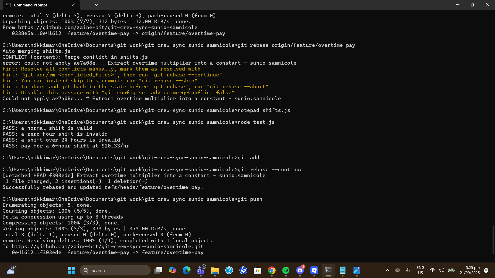
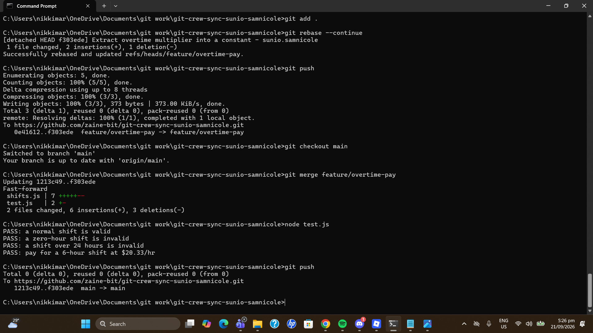
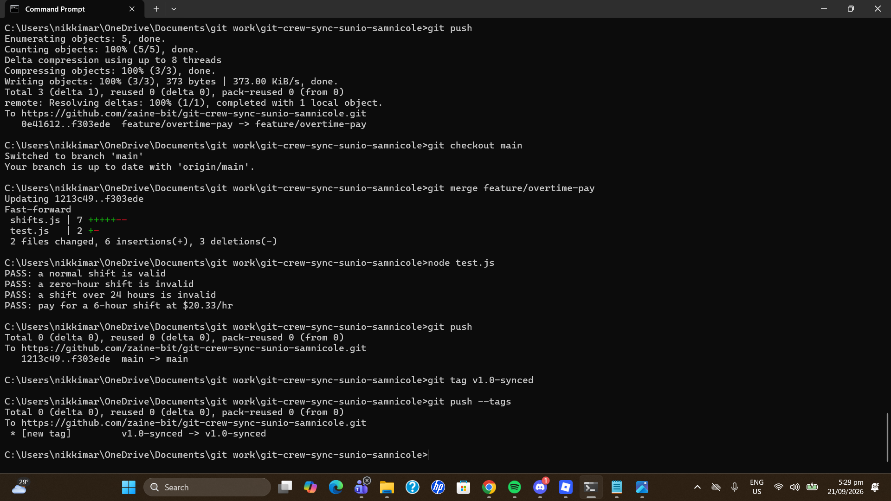
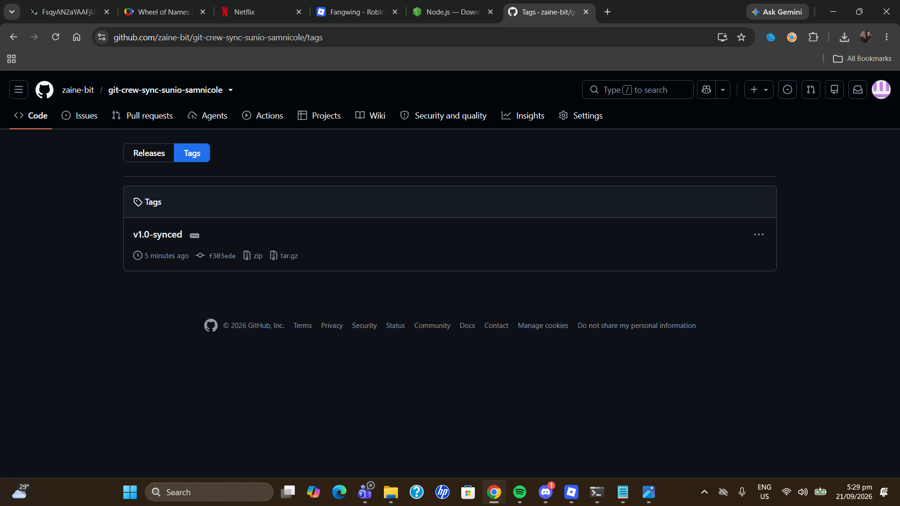

# Git Crew Sync Workflow - sunio.samnicole

## Task 1: Push a change from Clone A

## Task 2: Rejected push from Clone B

## Task 3: Reconcile with a merge

## Task 4: Reconcile with a rebase

## Task 5: Merge into main

## Task 6: Tag v1.0-synced

## Questions

### 1. What did the rejected push error message tell you, and why did it happen?
Git said `! [rejected] feature/overtime-pay -> feature/overtime-pay (fetch first)` and that the remote contains work I don't have locally. It hinted that I should integrate the remote changes before pushing again. It happened because Clone A had already pushed a commit to GitHub that Clone B never downloaded. Both clones had different commits on the same branch, and git refuses to overwrite the remote's commit because that would erase someone's work.

### 2. What's the difference between how I resolved Task 3 (merge) and Task 4 (rebase)?
In Task 3 I merged. Git kept both lines of work and joined them with a new merge commit that has two parents. I fixed the conflict once and committed the merge, so the history shows that the work diverged and then came together.

In Task 4 I rebased. Git lifted my commit off, put the commits from GitHub underneath, and replayed my commit on top. I fixed the conflict during the replay and ran `git rebase --continue`. The history is a straight line with no merge commit, and my commit got a new hash because it was rewritten. No force push was needed because my commit had never been pushed.

### 3. What one habit would have avoided both rejected pushes?
Running `git fetch` (or `git pull`) before starting work and before pushing. It shows what is already on the remote, so I can bring it in first instead of finding out when the push is rejected.

### 4. Which approach would I default to on a shared team branch, and why?
Merge. A shared branch has commits other people may have already pulled, and rebasing rewrites commits, which can break their copies and force them to clean up. Merge never changes existing commits, so it is safer. I would use rebase only on my
